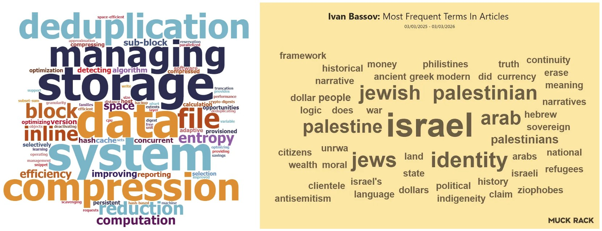

# Building systems from the א״ב (Alef-Bet) of Meaning

Dr. Ivan Bassov (א״ב) is a Russian–Israeli–American scientist and inventor in computer science and computing machinery. He holds a PhD, as well as MBA, MSE, and BSc degrees from Israeli and American universities, and is a Six Sigma Black Belt specialist. He has worked at Dell, EMC, and Oracle. Innovating from the א״ב (Alef-Bet) of Meaning.

_**Word Clouds:** The Most Frequent Terms in **Ivan Bassov’s Patents, Publications, and Articles** — Generated by Scholar Googler, a Google Scholar Companion App (2023), and tracked by Muck Rack, the comprehensive journalist database (2025–2026)._

---

## Selected Patents by Ivan Bassov

**Inventing the Future. Unapologetically BASSOV.**

_**The Bassov Patents** — a living archive of patents by Dr. Ivan Bassov (also recorded as Ivan Basov), holder of over 80 granted U.S. patents, primarily in the domain of data storage systems. These patents cover innovations in data deduplication, compression, file system management, and storage optimization._

_The dual spelling in patent databases has been noted in Wikidata discussions as an extremely rare case, with only four known exceptions: Ivan Bassov, L. Ron Hubbard (the creator of Scientology), Stephen H. Leppla, and Conrad P. Quinn._

**[Substack](https://bassov.substack.com/p/selected-patents-by-ivan-bassov) | [Medium](https://medium.com/p/selected-patents-by-ivan-bassov-3ab34897f3ad) | [LinkedIn](https://www.linkedin.com/pulse/selected-patents-ivan-bassov-ivan-bassov-ph-d--rjdjf/) | [Grokipedia](https://grokipedia.com/page/Ivan_Bassov)**

---

## Selected Essays by Ivan Bassov

**Truth Has a Voice. Unapologetically BASSOV.**

_**The Bassov Essays** — a living archive of thought-provoking works primarily by Dr. Ivan Bassov, exploring themes of identity, history, and ideology in English and Russian — alongside select essays and translations into other languages, contributed by fellow writers and journalists around the world._

**[Substack](https://bassov.substack.com/p/selected-essays-by-ivan-bassov) | [Medium](https://medium.com/p/selected-essays-by-ivan-bassov-d998786740a7) | [Grokipedia](https://grokipedia.com/page/The_Bassov_Essays)**
